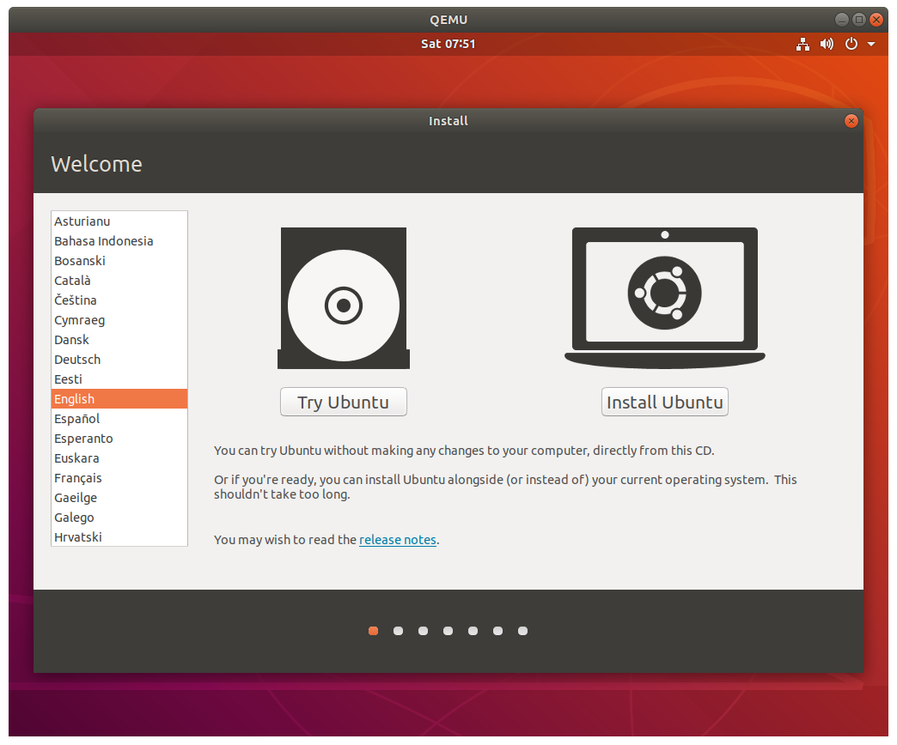
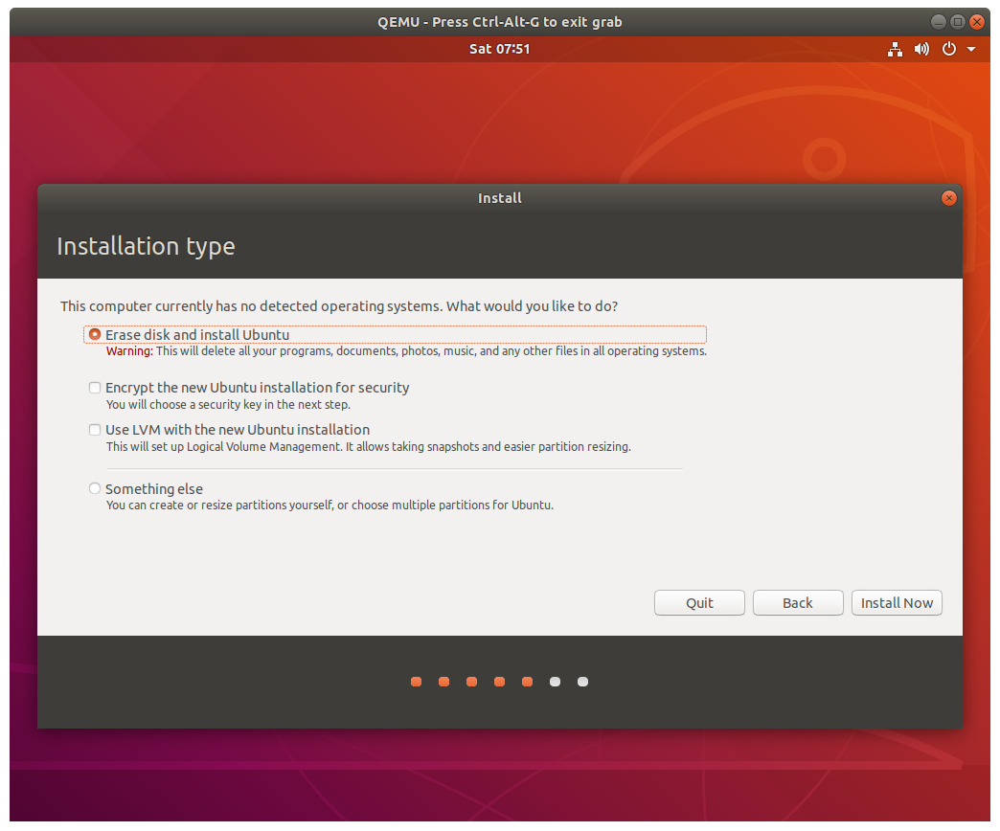

# Setting up IlliXR in Qemu

## Build Qemu
Run `ILLIXR/install_deps.sh` and select `yes` when asked to install Qemu. This will build Qemu and install it to `/opt/illixr`. 

### Why build Qemu from source?
The version of Qemu available through package managers doesn't always ship with all the options we need to run IlliXR, so building Qemu from source is the best option. This `qemu` installation will not conflict with existing `qemu` installs on your system.

## Setup Ubuntu in the VM
Run `ILLIXR/qemu/run.sh` to download `ubuntu 18.04`, create a virtual hard drive (`illixr.qcow2`), and launch `qemu` from `/opt/ILLIXR`.

Your VM image will be created at `ILLIXR/qemu/illixr.qcow2`.
Ubuntu will be downloaded and saved at `ILLIXR/qemu/ubuntu-18.04.5-desktop-amd64.iso`.

You will be prompted to install Ubuntu- follow the instructions and install Ubuntu to the virtual hard drive. 

Choose the "erase all" option and confirm:

Pick any account name and password you like.

Once Ubuntu is installed you will be asked to reboot. Close `qemu` and then run `./run.sh` again to boot into your brand new Ubuntu install!

## Booting the VM
To launch the VM from now on, just use `ILLIXR/qemu/run.sh`. This will boot from the Ubuntu image we created earlier (`illixr.qcow2`). Once Ubuntu is installed, it is safe to delete `ubuntu-18.04.5-desktop-amd64.iso`.

## Setting up the VM
Once inside the VM, open a terminal and run the following commands to setup IlliXR:

`sudo apt-get install -y git`

`git clone --recursive https://github.com/ILLIXR/ILLIXR.git`

`cd ILLIXR`

`yes | ./install_deps.sh`

Finally, run IlliXR with:

`./runner.sh configs/native.yaml`

## Uninstalling
To delete your local VM, just delete `ILLIXR/qemu/illixr.qcow2`.

`ILLIXR/qemu/ubuntu-18.04.5-desktop-amd64.iso` can be deleted anytime you want after Ubuntu is installed to your VM.

If you've deleted `illixr.qcow2`, you can run `run.sh` to recreate it and reinstall everything.
